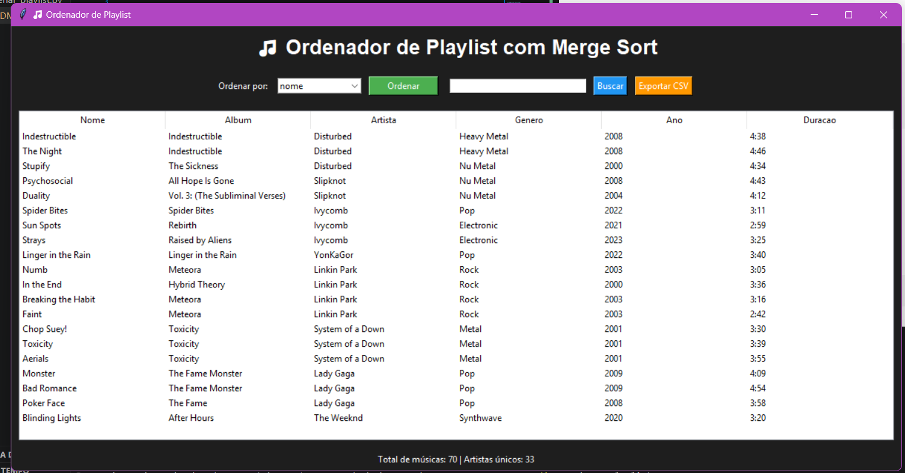

# G14_Ordenacao_EDA2-2026.1

## Alunos
|Matrícula | Aluno |
| -- | -- |
| 21/1030925  |  Amanda Gonçalves Sobrinho Abreu |
| 19/0112093  |  Lucas Freire Lopes |

## Ordenador de Playlist com Merge Sort

O programa realiza a ordenação de músicas utilizando o algoritmo **Merge Sort implementado manualmente**, sem utilização de bibliotecas prontas de ordenação.

Além da ordenação, o sistema possui interface gráfica para visualização da playlist, busca de músicas e exportação de arquivos CSV.


## Funcionalidades

- Ordenação utilizando Merge Sort
- Interface gráfica com Tkinter
- Busca de músicas
- Exportação de playlist para CSV
- Visualização em tabela
- Estatísticas da playlist
- Leitura de dados via CSV


## Algoritmo utilizado

O projeto utiliza o algoritmo:

#### Merge Sort

O Merge Sort é um algoritmo de ordenação baseado em divisão e conquista.

## Funcionamento:

1. Divide a lista em duas partes
2. Ordena cada parte recursivamente
3. Junta as partes ordenadas utilizando a função Merge

## Complexidade:

| Caso | Complexidade |
|---|---|
| Melhor caso | O(n log n) |
| Caso médio | O(n log n) |
| Pior caso | O(n log n) |

## Pré-Requisito

- Python instalado


##  Como executar

```bash
python ordenar_playlist.py
```


## Video

[Link para o vídeo.](https://youtu.be/9jdrQ1zSVoQ)
